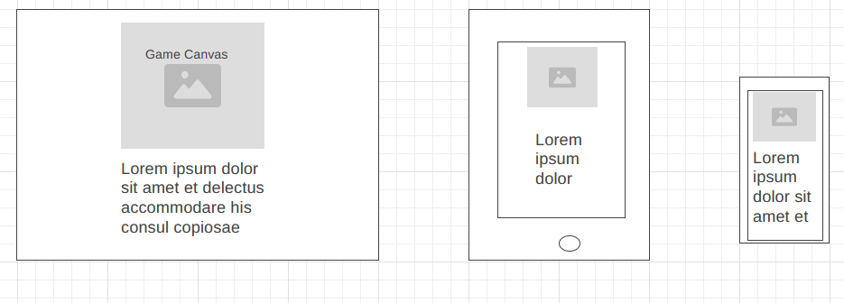

# Breakout style game
---
## Overview
---
Breakout is a block busting game, where each level increase the challenge through increase of ball speed and more hits required to clear a level.
Each block is colour coded so that each time it is hit, the block changes colour and then eventually breaks.

Using a canvas and CSS styling on a basic HTML page, I have created a completely Java Script based version of it, that could be used on sites as a break from massive amounts of information, or just as a fun, addictive game.

Breakout, the original game was released in 1976, quickly becoming a cult classic and the basis for the creation of a multitude of similar games.

#### [https://en.wikipedia.org/wiki/Breakout_(video_game)] "The game was a worldwide commercial success. It was among the top five highest-grossing arcade video games of 1976 in the U.S. and Japan, and among the top three in both countries for 1977."
---

---
## Table of Contents
---

- Site Structure and Design

---
## Site Structure and Design
---

Above is a basic wireframe design of how I wanted the website to look.  
I have organised the files into specific folders; 'css', 'javascript' & 'media' relevent to each type of file. As stated earlier, the project consists of HTML, CSS and Javascript.  Each written in their own files.  I have not used Phaser or anything else to write this code, it is of my own writing.  

### HTML

- index.html - This is the loading page and where the game, instructions and leaderboard are displayed.

### CSS
  #### css folder
- breakout.css - This is where the styling for the game was originally, and I had a separate style sheet for the HTML.  It made no sense to keep them separate, so I combined them.

### JavaScript
  #### javascript folder
- breakout.js - The functions and build of the game is in this file.  I kept it as a single file, to improve loading times.

### Media
  #### media folder
- background.jpg - One of my background choices for the site.  I found this to be too busy for the game and caused a distraction.
- background1.jpg - Another background that I found and decided would be too busy for the game.
- CSS Validator.png
- HTML Validator.png
- ResponsiveMockup.png
- Wireframe.png

---
## User Experience Design

### User Experience
- #### Target Audience
  - Any age group, though a particular appeal to those who remember the basic game styles.
  - Use to build hand-eye co-ordination
  - A Gamer or casual player.

- #### Expectations
  - A clear & concise game that is quick to load and easy to play.
  - A level system that increases in difficulty each level passed.
  - A webpage and game that functions as expected.  All buttons behave as they should and controls act as required.
  - A scoring system that allows a quick and easy way to view and track scores.

- #### Visitor Goals
  - ##### First Time Visitor
    - "What is this game?"
    - "How do I control this?"
  
  - ##### Returning Visitor
    - "Are my scores still here?"
    - "Can I beat my scores from last time?"
  
  - ##### Frequent Visitor
    - "Can I play this on any device?"

- #### Criteria To Meet
  - Is the game self explanatory, is it easy to identify as a game?
  - Are the methods of controlling the game clear and easy to read?
  - Is the Scoreboard accessible and easy to read?
  - Are the scores saved and will they update?
  - Is the game and web page responsive in design?
  - Does the background cause a distraction and allow all text to be easily viewed?

- #### Methods to Acheive the Criteria
  - There is a title and easily recognisable game title both on the webpage and the tab on the browser.
  - The instuctions are constantly visible and in a large clear font and colour.
  - The score board needs to load on page load and then again at game over.
  - The score board need to update with new high scores as well as store and recall on each load.
  - Use Bootstrap or CSS design to create a responsive design.
  - Check the backgrounds and have people test the game, asking specifically if the background is distracting.
