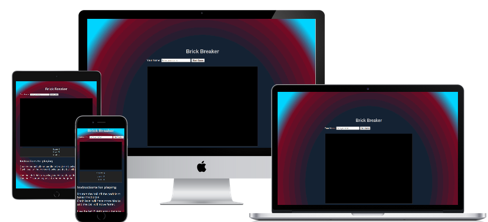

# Breakout style game
---
## Overview
---
Breakout is a block busting game, where each level increase the challenge through increase of ball speed and more hits required to clear a level.
Each block is colour coded so that each time it is hit, the block changes colour and then eventually breaks.

Using a canvas and CSS styling on a basic HTML page, I have created a completely Java Script based version of it, that could be used on sites as a break from massive amounts of information, or just as a fun, addictive game.

Breakout, the original game was released in 1976, quickly becoming a cult classic and the basis for the creation of a multitude of similar games.

#### [https://en.wikipedia.org/wiki/Breakout_(video_game)][The game was a worldwide commercial success. It was among the top five highest-grossing arcade video games of 1976 in the U.S. and Japan, and among the top three in both countries for 1977.]
---

---
## Table of Contents
---

- User Experience (UX)